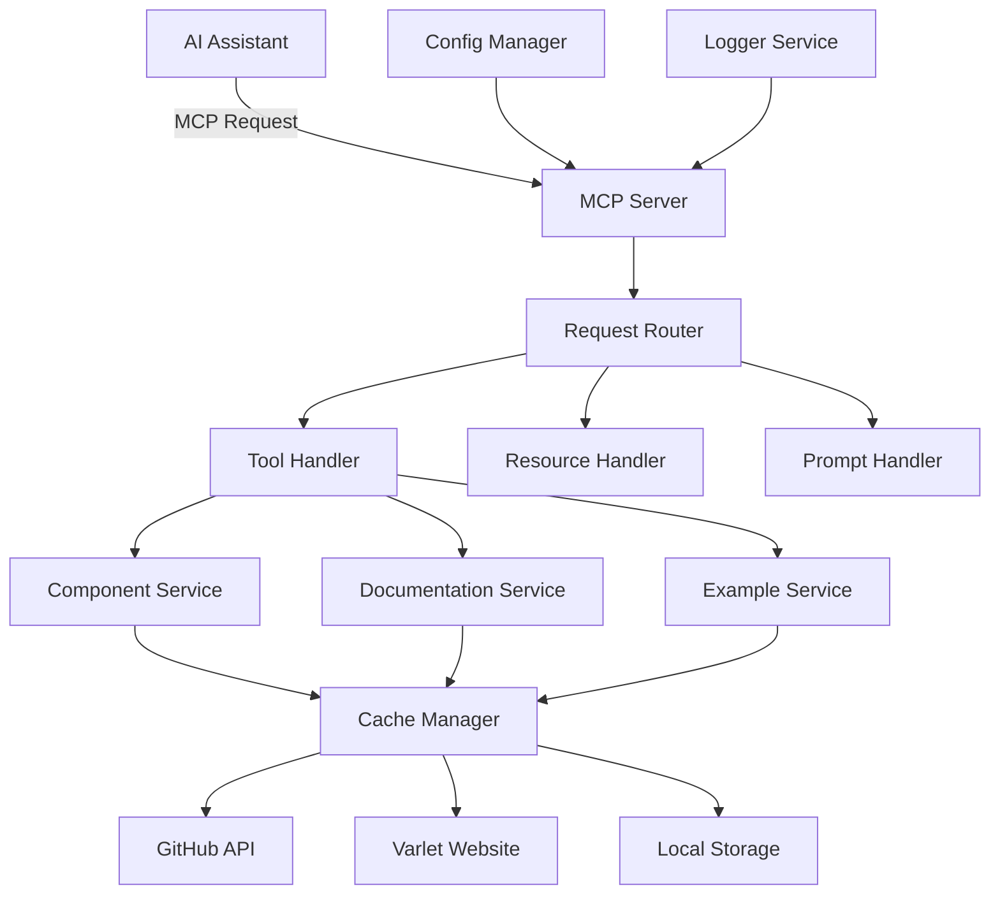
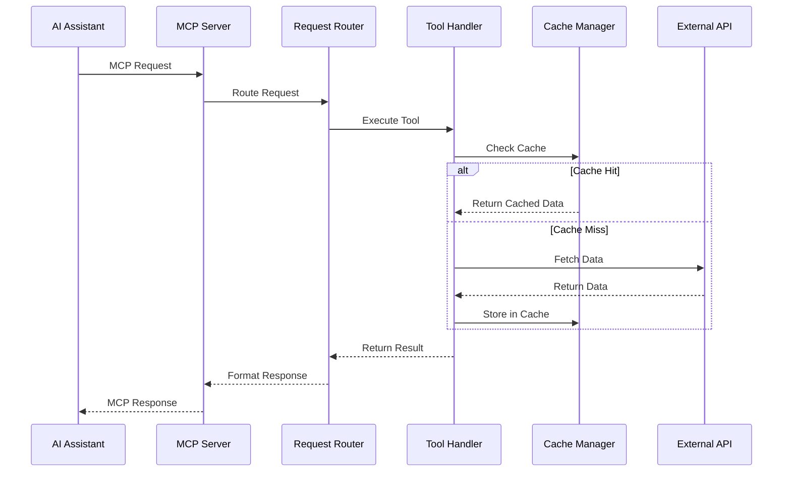
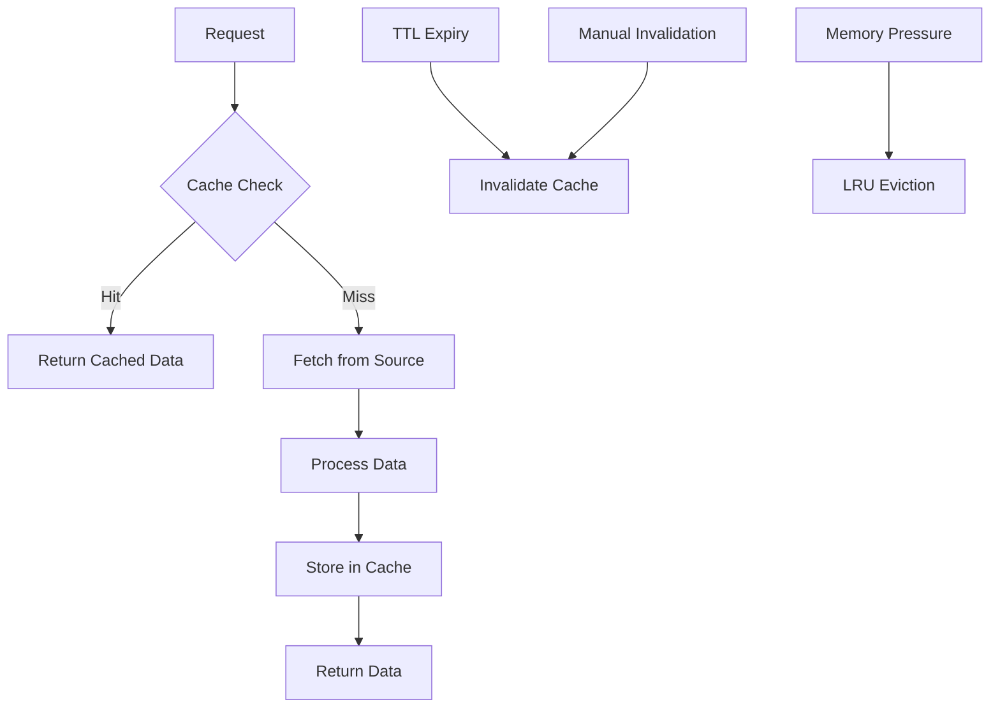
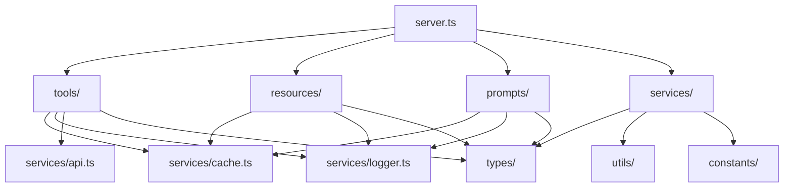

# Architecture Documentation

## 🏗️ Overview

Varlet MCP Server is designed as a modular, extensible Model Context Protocol server that provides AI assistants with deep integration to the Varlet UI ecosystem. This document outlines the system architecture, design decisions, and implementation details.

## 📋 Table of Contents

- [System Architecture](#system-architecture)
- [Core Components](#core-components)
- [Data Flow](#data-flow)
- [Module Structure](#module-structure)
- [Design Patterns](#design-patterns)
- [Performance Considerations](#performance-considerations)
- [Security Architecture](#security-architecture)
- [Extensibility](#extensibility)
- [Deployment Architecture](#deployment-architecture)

## 🏛️ System Architecture

### High-Level Architecture

```
┌─────────────────────────────────────────────────────────────┐
│                    AI Assistant (Claude)                    │
└─────────────────────┬───────────────────────────────────────┘
                      │ MCP Protocol
                      │ (JSON-RPC over stdio)
┌─────────────────────▼───────────────────────────────────────┐
│                 Varlet MCP Server                           │
├─────────────────────────────────────────────────────────────┤
│  ┌─────────────┐  ┌─────────────┐  ┌─────────────────────┐  │
│  │    Tools    │  │  Resources  │  │      Prompts        │  │
│  │             │  │             │  │                     │  │
│  │ • Component │  │ • API Docs  │  │ • Usage Examples    │  │
│  │ • Docs      │  │ • Examples  │  │ • Migration Guides  │  │
│  │ • Examples  │  │ • Guides    │  │ • Troubleshooting   │  │
│  │ • Migration │  │             │  │                     │  │
│  └─────────────┘  └─────────────┘  └─────────────────────┘  │
├─────────────────────────────────────────────────────────────┤
│                    Core Services                            │
│  ┌─────────────┐  ┌─────────────┐  ┌─────────────────────┐  │
│  │   Cache     │  │   Logger    │  │    Config Manager   │  │
│  │   Manager   │  │   Service   │  │                     │  │
│  └─────────────┘  └─────────────┘  └─────────────────────┘  │
├─────────────────────────────────────────────────────────────┤
│                   Data Sources                              │
│  ┌─────────────┐  ┌─────────────┐  ┌─────────────────────┐  │
│  │   GitHub    │  │   Varlet    │  │    Local Cache      │  │
│  │     API     │  │   Website   │  │                     │  │
│  └─────────────┘  └─────────────┘  └─────────────────────┘  │
└─────────────────────────────────────────────────────────────┘
```

### Component Interaction



## 🧩 Core Components

### 1. MCP Server Core

**Location**: `src/server.ts`

**Responsibilities**:
- MCP protocol implementation
- Request/response handling
- Tool/resource/prompt registration
- Error handling and logging

**Key Features**:
- JSON-RPC over stdio communication
- Automatic capability negotiation
- Graceful error handling
- Request validation

```typescript
class MCPServer {
  private tools: Map<string, Tool>;
  private resources: Map<string, Resource>;
  private prompts: Map<string, Prompt>;
  
  async handleRequest(request: MCPRequest): Promise<MCPResponse> {
    // Request routing and handling
  }
}
```

### 2. Tool System

**Location**: `src/tools/`

**Architecture**:
```
tools/
├── index.ts              # Tool registry
├── base/                 # Base classes
│   ├── tool.ts          # Abstract tool class
│   └── validator.ts     # Input validation
├── component/           # Component-related tools
│   ├── info.ts         # Component information
│   ├── list.ts         # Component listing
│   ├── props.ts        # Component properties
│   ├── events.ts       # Component events
│   └── slots.ts        # Component slots
├── documentation/       # Documentation tools
│   ├── search.ts       # Documentation search
│   ├── guide.ts        # Guide retrieval
│   └── changelog.ts    # Changelog access
├── examples/           # Example tools
│   ├── component.ts    # Component examples
│   ├── template.ts     # Template generation
│   └── playground.ts   # Playground links
└── migration/          # Migration tools
    ├── guide.ts        # Migration guides
    └── compatibility.ts # Compatibility checks
```

**Tool Interface**:
```typescript
interface Tool {
  name: string;
  description: string;
  inputSchema: JSONSchema;
  handler: (args: any) => Promise<any>;
}
```

### 3. Resource System

**Location**: `src/resources/`

**Architecture**:
```
resources/
├── index.ts              # Resource registry
├── base/                 # Base classes
│   └── resource.ts      # Abstract resource class
├── api/                 # API resources
│   ├── components.ts    # Component list
│   ├── directives.ts    # Directive list
│   └── utilities.ts     # Utility functions
└── examples/           # Example resources
    ├── quick-start.ts   # Quick start guide
    └── templates.ts     # Code templates
```

**Resource Interface**:
```typescript
interface Resource {
  uri: string;
  name: string;
  description: string;
  mimeType: string;
  handler: () => Promise<ResourceContent>;
}
```

### 4. Prompt System

**Location**: `src/prompts/`

**Architecture**:
```
prompts/
├── index.ts              # Prompt registry
├── base/                 # Base classes
│   └── prompt.ts        # Abstract prompt class
├── component/           # Component prompts
│   ├── usage.ts        # Usage examples
│   └── best-practices.ts # Best practices
├── layout/             # Layout prompts
│   ├── design.ts       # Design suggestions
│   └── responsive.ts   # Responsive design
├── migration/          # Migration prompts
│   ├── guide.ts        # Migration guidance
│   └── breaking-changes.ts # Breaking changes
├── troubleshooting/    # Troubleshooting prompts
│   ├── common-issues.ts # Common issues
│   └── debugging.ts    # Debugging help
└── performance/        # Performance prompts
    ├── optimization.ts  # Optimization tips
    └── best-practices.ts # Performance best practices
```

### 5. Cache Manager

**Location**: `src/services/cache.ts`

**Features**:
- LRU (Least Recently Used) eviction
- TTL (Time To Live) expiration
- Persistent storage
- Memory management
- Cache invalidation

**Architecture**:
```typescript
class CacheManager {
  private memoryCache: Map<string, CacheEntry>;
  private persistentCache: FileSystemCache;
  
  async get<T>(key: string): Promise<T | null> {
    // Memory cache first, then persistent cache
  }
  
  async set<T>(key: string, value: T, ttl?: number): Promise<void> {
    // Store in both memory and persistent cache
  }
}
```

### 6. Configuration Manager

**Location**: `src/services/config.ts`

**Features**:
- Environment variable support
- Configuration file support
- Runtime configuration updates
- Validation and defaults
- Type-safe configuration

**Configuration Schema**:
```typescript
interface Config {
  varlet: {
    version: string;
    baseUrl: string;
  };
  cache: {
    enabled: boolean;
    ttl: number;
    directory: string;
    maxSize: string;
  };
  api: {
    timeout: number;
    retries: number;
    rateLimit: {
      enabled: boolean;
      max: number;
      window: number;
    };
  };
  logging: {
    level: string;
    file?: string;
  };
}
```

### 7. Logger Service

**Location**: `src/services/logger.ts`

**Features**:
- Structured logging
- Multiple log levels
- File and console output
- Log rotation
- Performance metrics

```typescript
class Logger {
  info(message: string, meta?: object): void;
  warn(message: string, meta?: object): void;
  error(message: string, error?: Error, meta?: object): void;
  debug(message: string, meta?: object): void;
}
```

## 🔄 Data Flow

### Request Processing Flow



### Caching Strategy



## 🏗️ Module Structure

### Directory Structure

```
src/
├── server.ts                 # Main MCP server
├── index.ts                  # Entry point
├── cli.ts                    # CLI interface
├── tools/                    # MCP tools
│   ├── index.ts             # Tool registry
│   ├── base/                # Base classes
│   ├── component/           # Component tools
│   ├── documentation/       # Documentation tools
│   ├── examples/            # Example tools
│   └── migration/           # Migration tools
├── resources/               # MCP resources
│   ├── index.ts            # Resource registry
│   ├── base/               # Base classes
│   ├── api/                # API resources
│   └── examples/           # Example resources
├── prompts/                # MCP prompts
│   ├── index.ts           # Prompt registry
│   ├── base/              # Base classes
│   ├── component/         # Component prompts
│   ├── layout/            # Layout prompts
│   ├── migration/         # Migration prompts
│   ├── troubleshooting/   # Troubleshooting prompts
│   └── performance/       # Performance prompts
├── services/              # Core services
│   ├── cache.ts          # Cache management
│   ├── config.ts         # Configuration
│   ├── logger.ts         # Logging
│   ├── api.ts            # API client
│   └── validator.ts      # Input validation
├── types/                # Type definitions
│   ├── mcp.ts           # MCP types
│   ├── varlet.ts        # Varlet types
│   ├── config.ts        # Configuration types
│   └── api.ts           # API types
├── utils/               # Utility functions
│   ├── format.ts       # Data formatting
│   ├── validation.ts   # Validation helpers
│   ├── cache-key.ts    # Cache key generation
│   └── error.ts        # Error handling
└── constants/          # Constants
    ├── api.ts         # API constants
    ├── cache.ts       # Cache constants
    └── config.ts      # Configuration constants
```

### Module Dependencies



## 🎨 Design Patterns

### 1. Factory Pattern

**Usage**: Tool, Resource, and Prompt creation

```typescript
class ToolFactory {
  static createTool(type: string, config: ToolConfig): Tool {
    switch (type) {
      case 'component':
        return new ComponentTool(config);
      case 'documentation':
        return new DocumentationTool(config);
      default:
        throw new Error(`Unknown tool type: ${type}`);
    }
  }
}
```

### 2. Strategy Pattern

**Usage**: Cache strategies, API clients

```typescript
interface CacheStrategy {
  get(key: string): Promise<any>;
  set(key: string, value: any, ttl?: number): Promise<void>;
  delete(key: string): Promise<void>;
}

class MemoryCacheStrategy implements CacheStrategy {
  // Implementation
}

class FileCacheStrategy implements CacheStrategy {
  // Implementation
}
```

### 3. Observer Pattern

**Usage**: Configuration changes, cache events

```typescript
class ConfigManager extends EventEmitter {
  updateConfig(newConfig: Config): void {
    this.config = newConfig;
    this.emit('configChanged', newConfig);
  }
}

// Subscribers
cacheManager.on('configChanged', (config) => {
  // Update cache settings
});
```

### 4. Decorator Pattern

**Usage**: Tool enhancement, logging, caching

```typescript
function withCache(tool: Tool): Tool {
  return {
    ...tool,
    handler: async (args) => {
      const cacheKey = generateCacheKey(tool.name, args);
      const cached = await cache.get(cacheKey);
      if (cached) return cached;
      
      const result = await tool.handler(args);
      await cache.set(cacheKey, result);
      return result;
    }
  };
}
```

### 5. Command Pattern

**Usage**: CLI commands, tool execution

```typescript
interface Command {
  execute(args: any): Promise<any>;
}

class ToolCommand implements Command {
  constructor(private tool: Tool) {}
  
  async execute(args: any): Promise<any> {
    return this.tool.handler(args);
  }
}
```

## ⚡ Performance Considerations

### 1. Caching Strategy

**Multi-level Caching**:
- **L1**: In-memory cache (fastest)
- **L2**: File system cache (persistent)
- **L3**: External API (slowest)

**Cache Optimization**:
- LRU eviction for memory management
- TTL-based expiration
- Compression for large objects
- Background refresh for hot data

### 2. Memory Management

**Strategies**:
- Lazy loading of resources
- Streaming for large responses
- Memory pooling for frequent objects
- Garbage collection optimization

```typescript
class MemoryManager {
  private objectPool = new Map<string, any[]>();
  
  getObject<T>(type: string): T {
    const pool = this.objectPool.get(type) || [];
    return pool.pop() || this.createObject<T>(type);
  }
  
  returnObject<T>(type: string, obj: T): void {
    const pool = this.objectPool.get(type) || [];
    pool.push(obj);
    this.objectPool.set(type, pool);
  }
}
```

### 3. Async Processing

**Patterns**:
- Promise-based APIs
- Concurrent request processing
- Background tasks for cache warming
- Request batching for efficiency

```typescript
class RequestBatcher {
  private batches = new Map<string, Promise<any>>();
  
  async batchRequest<T>(key: string, fn: () => Promise<T>): Promise<T> {
    if (this.batches.has(key)) {
      return this.batches.get(key);
    }
    
    const promise = fn();
    this.batches.set(key, promise);
    
    try {
      return await promise;
    } finally {
      this.batches.delete(key);
    }
  }
}
```

### 4. Network Optimization

**Techniques**:
- Connection pooling
- Request compression
- Parallel requests where possible
- Circuit breaker for failing services

## 🔒 Security Architecture

### 1. Input Validation

**Layers**:
- JSON Schema validation
- Type checking
- Sanitization
- Rate limiting

```typescript
class InputValidator {
  static validate(schema: JSONSchema, input: any): ValidationResult {
    // Schema validation
    const schemaResult = validateSchema(schema, input);
    if (!schemaResult.valid) {
      return schemaResult;
    }
    
    // Sanitization
    const sanitized = sanitizeInput(input);
    
    // Additional validation
    return this.customValidation(sanitized);
  }
}
```

### 2. Error Handling

**Principles**:
- No sensitive information in error messages
- Structured error responses
- Proper error logging
- Graceful degradation

```typescript
class SecureErrorHandler {
  static handleError(error: Error, context: string): MCPError {
    // Log full error internally
    logger.error('Error occurred', error, { context });
    
    // Return sanitized error to client
    return {
      code: this.getErrorCode(error),
      message: this.getSafeMessage(error),
      data: this.getSafeData(error)
    };
  }
}
```

### 3. Rate Limiting

**Implementation**:
- Token bucket algorithm
- Per-client rate limiting
- Adaptive rate limiting
- Circuit breaker pattern

```typescript
class RateLimiter {
  private buckets = new Map<string, TokenBucket>();
  
  async checkLimit(clientId: string): Promise<boolean> {
    const bucket = this.getBucket(clientId);
    return bucket.consume();
  }
}
```

## 🔧 Extensibility

### 1. Plugin Architecture

**Future Enhancement** (v1.2.0):
```typescript
interface Plugin {
  name: string;
  version: string;
  tools?: Tool[];
  resources?: Resource[];
  prompts?: Prompt[];
  initialize?(server: MCPServer): Promise<void>;
  destroy?(): Promise<void>;
}

class PluginManager {
  async loadPlugin(plugin: Plugin): Promise<void> {
    await plugin.initialize?.(this.server);
    this.registerPluginComponents(plugin);
  }
}
```

### 2. Custom Tools

**Current Support**:
```typescript
// Custom tool registration
server.registerTool({
  name: 'custom_tool',
  description: 'My custom tool',
  inputSchema: {
    type: 'object',
    properties: {
      input: { type: 'string' }
    }
  },
  handler: async (args) => {
    // Custom implementation
  }
});
```

### 3. Configuration Extensions

**Support for**:
- Custom API endpoints
- Additional cache strategies
- Custom validation rules
- Extended logging options

## 🚀 Deployment Architecture

### 1. Standalone Deployment

```
┌─────────────────────────────────────┐
│            Host System              │
│  ┌─────────────────────────────────┐ │
│  │        Node.js Runtime          │ │
│  │  ┌─────────────────────────────┐ │ │
│  │  │    Varlet MCP Server        │ │ │
│  │  │                             │ │ │
│  │  │  • Tools                    │ │ │
│  │  │  • Resources                │ │ │
│  │  │  • Prompts                  │ │ │
│  │  │  • Cache                    │ │ │
│  │  └─────────────────────────────┘ │ │
│  └─────────────────────────────────┘ │
└─────────────────────────────────────┘
```

### 2. Containerized Deployment

```
┌─────────────────────────────────────┐
│            Docker Host              │
│  ┌─────────────────────────────────┐ │
│  │        Docker Container         │ │
│  │  ┌─────────────────────────────┐ │ │
│  │  │      Alpine Linux           │ │ │
│  │  │  ┌─────────────────────────┐ │ │ │
│  │  │  │    Node.js Runtime      │ │ │ │
│  │  │  │  ┌─────────────────────┐ │ │ │ │
│  │  │  │  │ Varlet MCP Server   │ │ │ │ │
│  │  │  │  └─────────────────────┘ │ │ │ │
│  │  │  └─────────────────────────┘ │ │ │
│  │  └─────────────────────────────┘ │ │
│  └─────────────────────────────────┘ │
│  ┌─────────────────────────────────┐ │
│  │           Volumes               │ │
│  │  • Cache Directory              │ │
│  │  • Configuration Files         │ │
│  │  • Log Files                   │ │
│  └─────────────────────────────────┘ │
└─────────────────────────────────────┘
```

### 3. Cloud Deployment

```
┌─────────────────────────────────────────────────────────┐
│                    Cloud Platform                       │
│  ┌─────────────────┐  ┌─────────────────────────────────┐ │
│  │  Load Balancer  │  │         Container Service       │ │
│  │                 │  │  ┌─────────────────────────────┐ │ │
│  │  • SSL Term     │  │  │      Instance 1             │ │ │
│  │  • Health Check │  │  │  ┌─────────────────────────┐ │ │ │
│  │  • Rate Limit   │  │  │  │   Varlet MCP Server     │ │ │ │
│  └─────────────────┘  │  │  └─────────────────────────┘ │ │ │
│           │            │  └─────────────────────────────┘ │ │
│           │            │  ┌─────────────────────────────┐ │ │
│           └────────────┼─▶│      Instance 2             │ │ │
│                        │  │  ┌─────────────────────────┐ │ │ │
│                        │  │  │   Varlet MCP Server     │ │ │ │
│                        │  │  └─────────────────────────┘ │ │ │
│                        │  └─────────────────────────────┘ │ │
│                        └─────────────────────────────────┘ │
│  ┌─────────────────────────────────────────────────────────┐ │
│  │                 Shared Services                        │ │
│  │  • Redis Cache                                         │ │
│  │  • Monitoring                                          │ │
│  │  • Logging                                             │ │
│  └─────────────────────────────────────────────────────────┘ │
└─────────────────────────────────────────────────────────────┘
```

## 📊 Monitoring and Observability

### 1. Metrics Collection

**Key Metrics**:
- Request count and latency
- Cache hit/miss ratios
- Memory and CPU usage
- Error rates
- API response times

```typescript
class MetricsCollector {
  private metrics = new Map<string, Metric>();
  
  incrementCounter(name: string, labels?: Record<string, string>): void {
    // Implementation
  }
  
  recordHistogram(name: string, value: number, labels?: Record<string, string>): void {
    // Implementation
  }
  
  setGauge(name: string, value: number, labels?: Record<string, string>): void {
    // Implementation
  }
}
```

### 2. Health Checks

**Endpoints**:
- `/health` - Basic health status
- `/ready` - Readiness probe
- `/metrics` - Prometheus metrics

### 3. Distributed Tracing

**Future Enhancement**:
- OpenTelemetry integration
- Request correlation IDs
- Performance profiling

---

## 🔮 Future Architecture Enhancements

### 1. Microservices Architecture (v2.0.0)

- Split into specialized services
- Event-driven communication
- Independent scaling
- Service mesh integration

### 2. GraphQL API (v1.2.0)

- Flexible data fetching
- Type-safe queries
- Real-time subscriptions
- Better caching strategies

### 3. Plugin Ecosystem (v1.2.0)

- Third-party plugin support
- Plugin marketplace
- Sandboxed execution
- Version management

### 4. Advanced Caching (v1.1.0)

- Distributed caching with Redis
- Cache warming strategies
- Intelligent prefetching
- Cache analytics

---

This architecture documentation provides a comprehensive overview of the Varlet MCP Server's design and implementation. For specific implementation details, refer to the source code and individual module documentation.